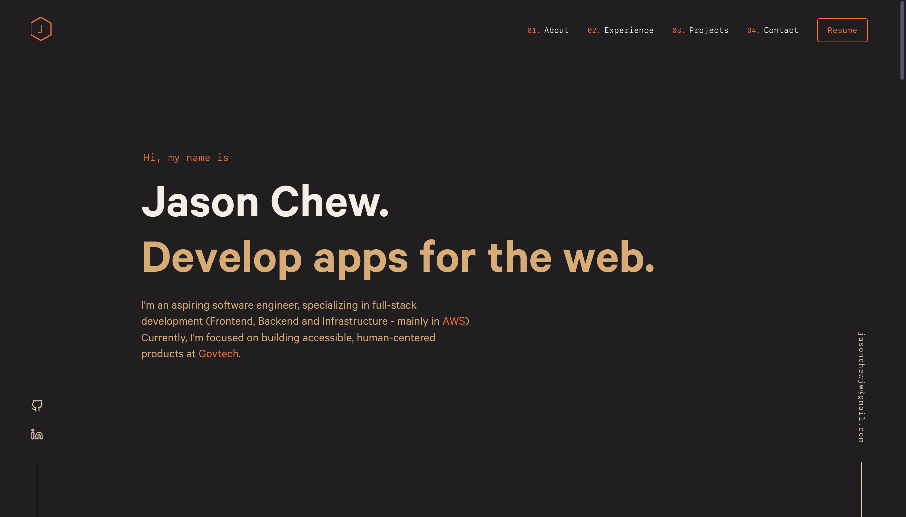

# jason-resume-v5

# To run locally

1. Git pull resume locally
2. Open local root repository terminal and enter the following line to install depdenencies:

```bash
yarn
```

3. Once completed, enter the following to start the application:

```bash
yarn start
```

Once completed, you will see the following:

